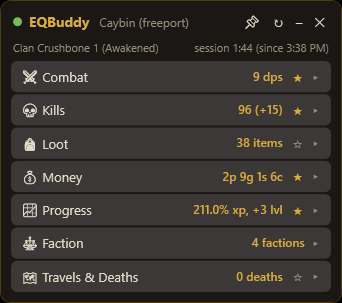
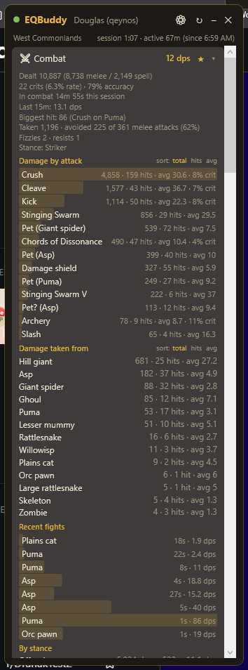
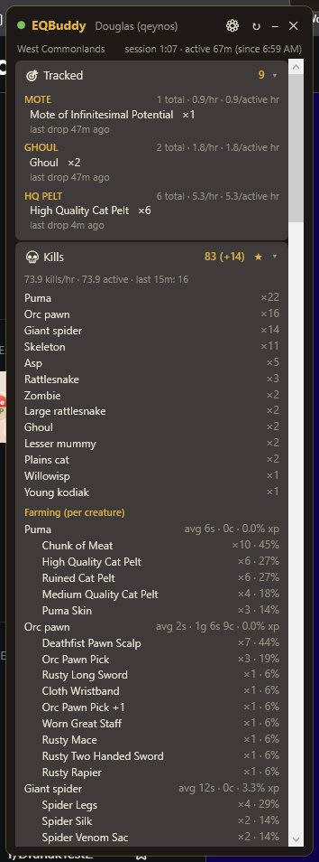

# EQBuddy — EverQuest Legends Session Tracker

An always-on-top Windows widget that reads your EverQuest Legends `/log` file live and
shows what's happened this play session: kills, DPS, loot, money, XP, skill-ups,
faction changes, deaths, and zones visited. Click any section to drill into details.

**Download:** grab `EQBuddySetup.exe` from the
[latest release](https://github.com/DranakCorps-bot/EQBuddy/releases/latest).
EQBuddy checks for new releases itself (at startup, every 6 hours, and via
right-click → "Check for updates") and shows a banner linking to the latest
download when one is available.

## Screenshots

| | |
|---|---|
|  |  |
| The default card — one glanceable line per category | Mini mode — starred stats plus pinned watch-rule chips; alert banners pop even here |
|  |  |
| Full drill-down: damage per skill/spell/pet, recent fights with per-fight DPS, damage and DPS by stance | Watch rules (loot, kills, skill-ups…) with per-hour rates, per-creature farming stats, merchant sales |
|  |  |
| Every session lands in a local, searchable history — notes, tags, compare, export | Background see-through — watch the game right through the widget |

## For players (family install guide)

1. Run **EQBuddySetup.exe** and click through the installer (no admin needed).
2. Launch **EQBuddy** from the Start Menu or desktop shortcut.
3. Start EverQuest Legends and log into your character.
4. Play! The widget updates live. Click a section (Combat, Kills, Loot, …) to expand details.
   - EQBuddy turns the game's logging on permanently (it sets `Log=1` in `eqclient.ini`
     whenever the game isn't running), so you normally never need to type `/log`.
   - The dot in EQBuddy's corner turns **green** when it's receiving data. If it's red
     with a yellow banner during play, type `/log` in the game's chat as a one-time fix.

Mini dashboard:
- Click the **★ star** next to any section header to include that stat in the mini dashboard.
- Click **–** in the title bar to minimize: only your starred stats remain, in a tiny
  always-on-top pill (e.g. `💀 12  ⚔ 34 dps`). Great while actually fighting.
- Double-click the pill (or click ⤢) to expand back to the full view.

Updates (automatic, no internet service involved):
- EQBuddy checks the family's shared **EQBuddyDownload** OneDrive folder at startup and
  every 6 hours. When a newer version is there, a green banner appears — click it and
  EQBuddy installs the update silently and restarts itself.
- Right-click the widget → **Check for updates** to check on demand.
- On a family PC where the shared folder syncs to a different path, EQBuddy auto-finds a
  folder named `EQBuddyDownload` under that PC's OneDrive; if it can't, set `UpdateFolder`
  in `%AppData%\EQBuddy\settings.json`.

Log cleanup (automatic, optional):
- Because logging is always on, EQBuddy empties any character log that has been quiet
  for 60+ minutes (a finished play session), so files never grow across sessions.
  Cleanup runs at EQBuddy startup and every 10 minutes — but never while the game is open.
- If you keep your logs (to upload to another parser, for example), turn off
  **"Auto-empty finished-session logs"** in ⚙ Options — EQBuddy then never touches your
  log files, but they'll grow forever, so clean them up yourself occasionally.

Tracked loot & alerts:
- ⚙ Options → **Tracked loot**: add simple match texts (e.g. `mote`) — the 🎯 Tracked
  card shows every matching item name, quantities, and per-hour rates (wall-clock and
  active-play). 📌 pins a chip to the mini dashboard; 🔔/🔊 fire a focus-safe banner
  and/or sound the moment a matching item drops. A rule has a short *name* and a
  *match text* — if you only fill in the name, it doubles as the match text, so
  typing just `Ghoul` on a Kill rule works. Alert banners appear in mini mode too.
- **Alert sound** (Options, under the rules): pick from seven distinct built-in
  sounds (Ding, Notify, Chimes, Chord, Tada, Exclamation, Alarm) or your own
  `.wav`/`.mp3` file; ▶ previews it.
- Stats show **recent-window rates** ("Last 15m") alongside session averages — pick 5,
  15, or 30 minutes in Options — plus per-active-hour rates that ignore downtime.

Encounters, mob farming, and stances:
- Combat shows your **recent fights** (creature, duration, per-fight DPS) and, when your
  class uses stances, a **By stance** breakdown of damage, combat time, and DPS with the
  current stance named in the summary.
- Kills shows **per-creature farming**: average fight length, coin, and XP per creature,
  plus each creature's observed drops with your personal drop % (the History window
  shows the full x/y kill counts behind each rate — these are your rates, not the game's).
- Watch rules aren't just loot anymore: a rule can watch **Loot, Kills (creature name),
  Skill-ups, Deaths, or Milestones** (levels/AA) — same counters, chips, and alerts.
- History window: **Ctrl-click two sessions to compare** their rates side-by-side, and
  **Import log…** parses any old eqlog file into your session history.

Session history (automatic):
- Every meaningful session is saved to a local SQLite database
  (`%AppData%\EQBuddy\history.db`) — no uploads, nothing manual. Sessions end and save
  when you go quiet for 60+ minutes, switch characters, or close EQBuddy; the active
  session checkpoints every 5 minutes so a crash loses almost nothing.
- ⚙ → **Session history…** opens the browser: filter by character, search anything
  (zone, loot, creature names, notes, tags), view the full per-session breakdown, add
  notes/tags, copy a shareable summary, export JSON, or delete.

Hotkeys (global, defaults; edit in `%AppData%\EQBuddy\settings.json`):
- `Ctrl+Shift+H` show/hide the widget · `Ctrl+Shift+T` click-through (game clicks pass
  through the widget; border turns amber) · `Ctrl+Shift+M` mini mode ·
  `Ctrl+Shift+K` drop a camp marker (also in the right-click menu; markers appear under
  Travels & Deaths).
- ⚙ Options → **Overlay cards**: reorder cards and hide the ones you don't want —
  hidden cards keep collecting data.

Custom install locations:
- EQBuddy finds the game via the installer's registry entry, so non-default install paths
  are usually detected automatically. If yours isn't, **right-click the widget →
  "Choose log folder…"** and pick the game's `Logs` folder (picking the install folder
  itself also works). "Auto-detect log folder" reverts to automatic detection.

Notes:
- The title bar shows which character EQBuddy is following. It always tracks whoever is
  actively playing (the log file that's currently growing) and switches automatically
  within a few seconds when you swap characters.
- The ↻ button clears the session and starts counting from now.
- The widget always stays on top of the game. Drag anywhere on it to move it;
  its position is remembered.
- ⚙ (or right-click) → **Options…** has sliders for widget size (scales everything,
  fonts included, 80–160%), background see-through (only the dark panel fades — text
  stays sharp so you can watch the game through the widget), and whole-widget opacity.
  Changes apply live and are remembered.
- Loot that the game auto-sells on pickup counts as both loot and merchant income.
  Selling straight from the **advanced loot window** is captured too, credited to the
  item named on the game's "destroyed" line. The log always records which corpse an
  item came from (even when the advanced loot window hides it), so per-creature drop
  rates work regardless of how you loot.
- A "session" is a contiguous stretch of play. After 60+ minutes of no log activity,
  the next activity starts a fresh session automatically.

## How DPS is measured

Session DPS = your damage ÷ time actually **in combat**, so downtime never dilutes it.

- **Your pet counts — summoned or charmed.** EQBuddy learns your pet's name from its
  "Attacking X Master." chatter and credits its melee and spell damage to you (shown as
  "Pet (Name)" in the damage breakdown). Pet kills count as your kills. A charm landing
  ("an asp blinks.") claims the creature provisionally — its damage shows as
  "Pet? (Name)" until a Master message confirms it, then merges into "Pet (Name)".
  If a pet ever damages you (charm broke), it stops being credited.
- The combat clock opens when *you* act — hit, miss, pet attack, or getting hit — and
  stays open while your group keeps fighting, so slow-swinging melee and casters between
  casts aren't penalized mid-fight.
- Others' fighting only keeps your clock running for ~20 s past your last action:
  tagging one mob doesn't charge you for the whole group fight, and idle time in a busy
  zone never counts. The clock closes after 10 quiet seconds.
- The Combat detail view shows total time-in-combat so you can see the denominator.

## What it tracks

| Section | Summary stat | Click-in details |
|---|---|---|
| Combat | Session DPS (+ live fight DPS) | Details!-style damage breakdown per attack/spell/song — share-of-total bars, % of damage, per-ability DPS and crit rate (totals/hits/averages in tooltips; sortable by dps/hits/avg); crit rate, accuracy, melee avoidance %, biggest hit, time in combat, damage taken per mob, fizzles/resists |
| Healing | HPS (healing ÷ time in combat) | Healing done and received, heals cast per spell with totals/casts/averages, who healed you, hymn/regen tick counts (the log gives no amounts for those) |
| Kills | Your kills incl. pet (+ group kills) | Count per creature type, kills/hour, group-member kill counts; per-creature farming: avg fight length, coin, XP, and observed drops with your personal rate (e.g. `×2 · 22%`) |
| Loot | Items looted (+ items made) | Every item with counts, items created by merging |
| Money | Coin earned (p/g/s/c) | Corpse coin vs merchant-sale income, items sold with prices, biggest drop, money per hour |
| Progress | XP % gained (+ levels, + AA) | XP ticks, %/hour, AA points gained with AA/hour, estimated time to next level, level-ups with times, skill-ups per skill |
| Faction | Factions touched | Net standing change per faction |
| Travels & Deaths | Death count | Each death (what killed you, when), zones visited with times |

## For developers

- `src/EQBuddy` — WPF app (.NET 10, `net10.0-windows`). Build on Windows:
  `dotnet build src/EQBuddy/EQBuddy.csproj -c Release`. From non-Windows machines,
  add `-p:EnableWindowsTargeting=true`.
- `src/EQBuddy.Avalonia` — cross-platform Avalonia app (.NET 10). Build:
  `dotnet build src/EQBuddy.Avalonia/EQBuddy.Avalonia.csproj -c Release`.
- `src/EQBuddy.Core` — shared parser, watcher, settings, update, and session-stat logic.
  Both UI projects reference this; UI-independent code goes here.
- `src/EQBuddy.Core/LogParser.cs` — one regex per log-line type; add new patterns here.
- `src/EQBuddy.Core/SessionStats.cs` — aggregation + DPS fight tracking + session rollover.
- `src/EQBuddy.Core/LogWatcher.cs` — file tailing (500 ms polls, offset-based, truncation-safe).
- `src/EQBuddy.Core/EqConfig.cs` — log hygiene: forces `Log=1` in eqclient.ini and truncates
  stale (60+ min quiet) logs; both are skipped while `eqgame.exe` is running.
- Publish: `dotnet publish -c Release -r win-x64 --self-contained -p:PublishSingleFile=true -o dist/publish`
- Release: `scripts\release.ps1` — reads the version from the csproj, publishes, signs both
  exes (self-signed cert; create once with `scripts\new-cert.ps1`), compiles the installer
  with the matching version stamp, and copies to the OneDrive family folder. Pass
  `-Tag vX.Y.Z` to also publish a GitHub release. Bump `<Version>` in the csproj first —
  the in-app updater compares it against the version stamped into the shared setup exe.
- Settings live in `%AppData%\EQBuddy\settings.json`; errors in `%AppData%\EQBuddy\error.log`.
- Debug: set `EQBUDDY_EXPAND=1` to launch with all sections expanded plus a state dump
  in `%AppData%\EQBuddy\debug.txt`. Set `EQBUDDY_APPDATA=<dir>` to run against an
  isolated profile (settings, history, logs) without touching your real data.

Log folder auto-detected at
`C:\Users\Public\Daybreak Game Company\Installed Games\EverQuest Legends\Logs`
(`eqlog_<Character>_<server>.txt`).

## License

MIT — see [LICENSE](LICENSE). Contributions welcome; parser fixes go fastest when the
issue or PR includes the raw log lines involved.
