# EQBuddy — Your Personalized Guide to Norrath

> **EQBuddy Evolved** is the next major direction: a finished, personal companion
> for EverQuest Legends — not another feature-count race. **Current public
> downloads remain the 1.x line** until the v2 channel opens. Evolved is not a
> download yet.
>
> | | |
> |---|---|
> | **Identity & vision** | [PRODUCT.md](PRODUCT.md) · [EQBuddy-Evolved.md](EQBuddy-Evolved.md) |
> | **1.x stays up** | [LEGACY-V1.md](LEGACY-V1.md) · [issue #275](https://github.com/DranakCorps-bot/EQBuddy/issues/275) |
> | **Supported** | Windows Evolved desktop + EQBuddy Mobile hosted by Windows |
> | **Preserved** | Linux/macOS (and Windows) 1.x final builds — downloadable and usable. We are **not** removing them. |

An always-on-top widget that reads your EverQuest Legends `/log` file live and turns
it into everything worth knowing about your session: kills and DPS, a **fight
timeline** that draws every swing on one canvas with smooth, honest DPS curves,
loot with personal drop rates, money, XP, spawn timers that learn from your kills
(and know the difference between an open-world camp and a raid instance), mez
countdowns, **buff timers that learn your character's real durations**,
**raid-target tracking with D0–D4 difficulty badges**, a **slow alert with the cure
attached**, a **Gear Locker** that compares every wearable you own per slot and
flags arithmetic dump candidates, a **built-in catalog of 11,000+ items** (stats,
quests, recipes, drop zones — instant and offline, refreshed weekly from the
community wiki), a quest tracker that flags what you're ready to turn in, and
alerts you write yourself (substring or regex, per-rule sounds and colors, a spoken
voice — or just click a recent log line and it becomes a rule). Click any card to
drill into details; every session lands in a local searchable history with level
and AA progress charts. A tray icon keeps EQBuddy one click away even when the
widget hides itself with the game.

**New: [EQBuddy Mobile](#eqbuddy-mobile-beta)** puts any of it on the phone or tablet
already sitting beside your keyboard — scan a code once and that device becomes a
second screen, showing whichever windows *it* chooses. LAN-only, off until you turn
it on, nothing to install on the device.

**EQBuddy is a beta, improving weekly — and most features on this page started as a
player's suggestion.** Rough edges, wild ideas, wrong numbers: [say so in
Discussions](https://github.com/DranakCorps-bot/EQBuddy/discussions) and watch what
happens.

**Log-only, by principle. Zero telemetry, always contribution.** EQBuddy never reads
game memory, never phones home, and never measures other players — it knows only what
your own log says. When knowledge moves between players, it moves because a player
chose to move it: zone spawn archives export as paste-safe strings you hand to a
friend, imports show you every change before anything applies, and contributions to
EQBuddy itself go through a public review on GitHub — streamlined collaboration from
within the community, never a quiet upload. **Windows is the supported desktop** for
EQBuddy Evolved. Linux and macOS 1.x builds remain downloadable — Linux was built and
maintained by Don Thompson; macOS click-through, spoken alerts, and Wine-prefix log
detection were contributed by quasarj — and we are **not** taking those builds down.
See [LEGACY-V1.md](LEGACY-V1.md) for the support matrix.

**Download:** grab `EQBuddySetup.exe` from the
[latest release](https://github.com/DranakCorps-bot/EQBuddy/releases/latest).
EQBuddy checks for new releases itself (at startup, every 6 hours, and via
right-click → "Check for updates") and shows a banner when one is available.
Click it and EQBuddy downloads the signed installer from the release, checks it
against the published SHA-256, installs, and restarts — no browser trip. If the
hash isn't published it won't download anything and points you at the release
page instead.

## Screenshots

| | |
|---|---|
| 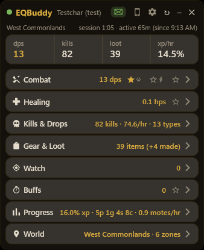 | 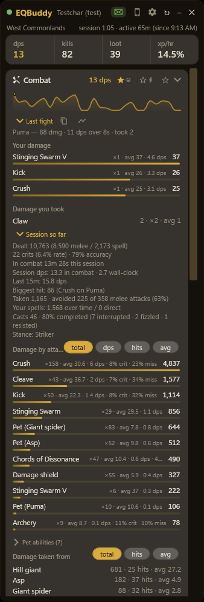 |
| **The widget at a glance** — one line per card: Combat, Healing, Kills & Drops, Quests, Gear & Loot, Watch, Buffs, Progress, Motes and Travels & Deaths. Click any card to expand it. (The 1.98/1.99 organizing pass folded the old Money, Faction, Raids and Motes cards into **Progress**, Loot and Gear into **Gear & Loot**, Kills and Drops-by-Creature into **Kills & Drops**, and Sky Quest and Epics into **Quests** — every one of them can be switched back on individually in ⚙ Options → Cards & windows.) | **Full drill-down** — damage per skill with crit *and miss* rates inline, hit ranges on hover, last-fight breakdowns, and both session DPS models labeled: in-combat and wall-clock |
| 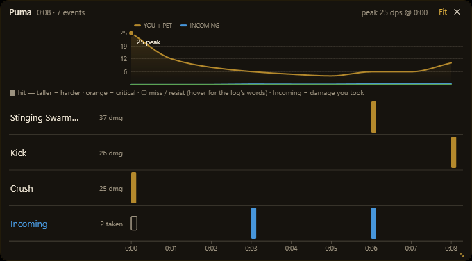 | 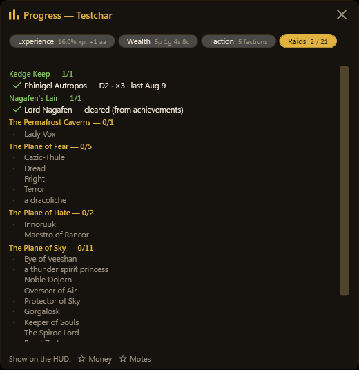 |
| **Fight timeline** — the whole pull on one canvas: a lane per skill, solid bars for hits (taller = harder, bright = critical), hollow outlines for misses and resists with the log's own words on hover, dotted markers where you swapped stance or invocation, and a smoothed DPS-over-time graph whose curves mathematically can't exaggerate — colors are colorblind-validated, and damage you took wears blue so red always means trouble | **Buff timers & raid targets** — buffs count down with honest `est` labels until a natural fade teaches your character's *real* duration; the Progress window's Raids tab remembers every raid target your log saw die, now with **D0–D4 difficulty badges** for the highest tier a witnessed kill proves |
| 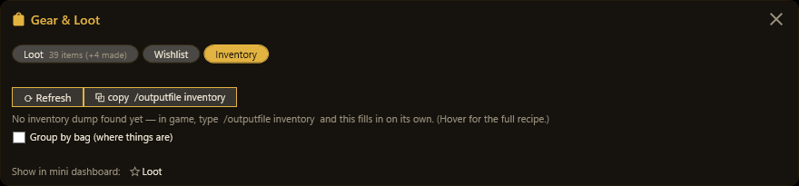 | 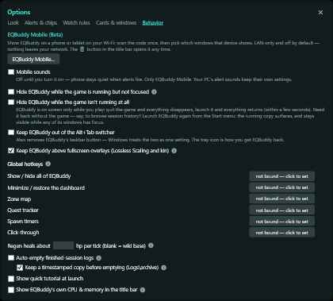 |
| **Gear Locker is now the Inventory tab of the Gear & Loot card** — every wearable you own, grouped by slot and compared against the rest of your bags: an item beaten on every stat by something else you hold gets flagged **⬇ outclassed**, a dump candidate by arithmetic, not taste. Stats come from the built-in 11,000+-item catalog, instantly — never "BiS", it ranks *your* bags | **It gets out of your way** — hide the widget when the game loses focus, or whenever the game isn't running at all; a tray icon stays put so EQBuddy is always one click from coming back |
| 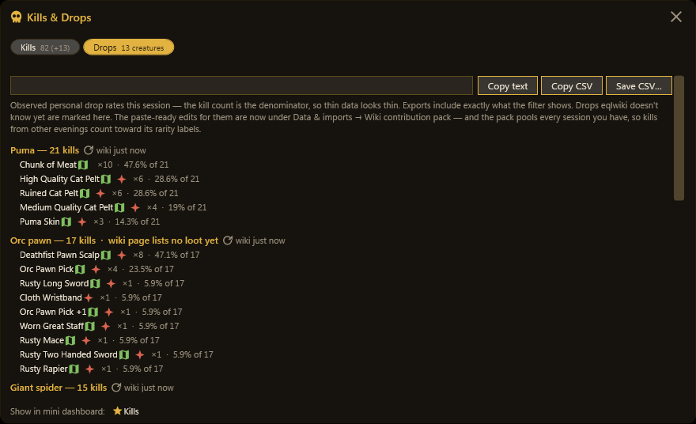 | 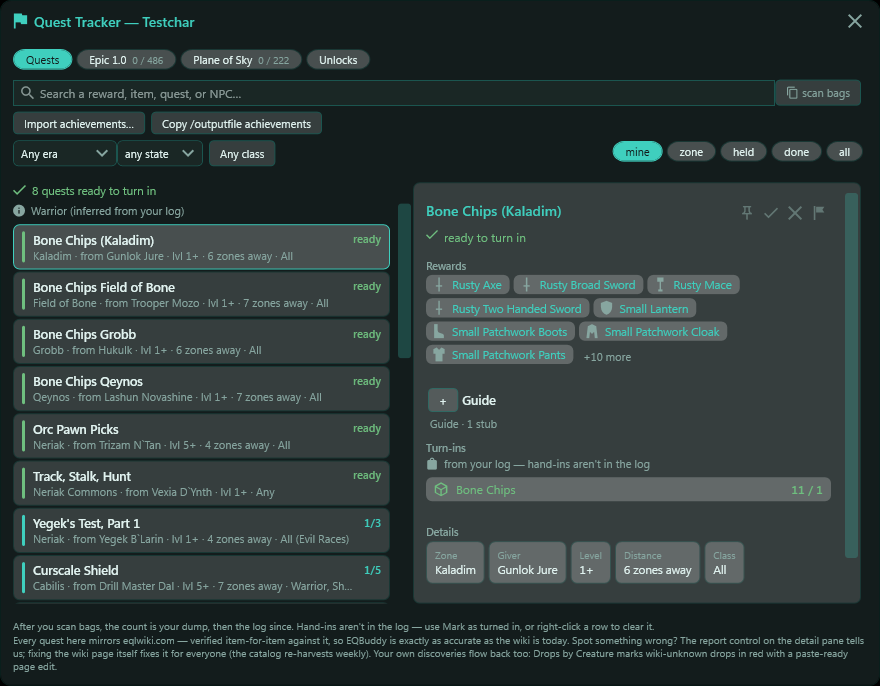 |
| **Drops by Creature** — your personal drop rates per mob, with ✦ marking drops the [community wiki](https://eqlwiki.com) doesn't know yet and **✦ Copy for wiki** building a paste-ready contribution | **Quest Tracker** — 1,172 wiki quests as a scannable list beside a detail pane; loot something a quest wants and its row flips to **ready** with a green rule down its edge, sorted by how close the quest is to where you're standing |
| 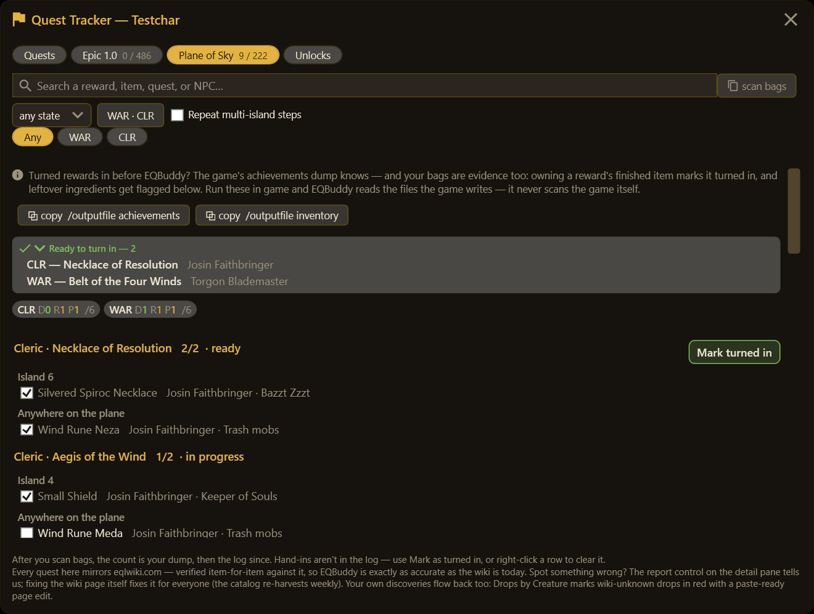 | 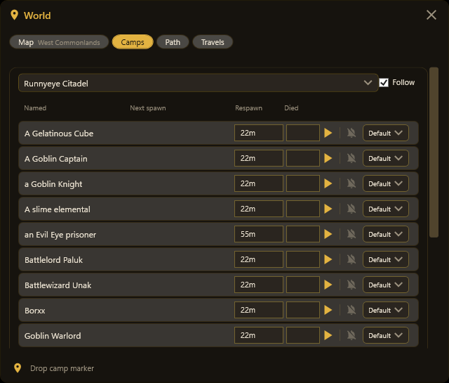 |
| **The Sky Quest card is now the Plane of Sky tab of the Quest Tracker** (right-click → *Quest tracker…*, or the Quests card) — all 222 turn-in items, filtered by a class chip strip rather than a card per class; loot auto-checks *your* class's boxes, a **Ready to turn in** block leads with what you can hand in right now, and a reward's own checkbox marks the quest turned in | **Spawn timers are now the Camps tab of the World window** (right-click → *World…*, or the World card) — kill a named (or its placeholder) and a countdown chip appears; timers tighten themselves from your own kills, every duration editable |
| 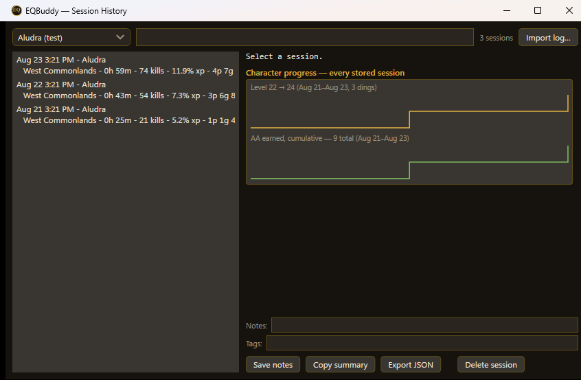 | 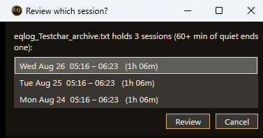 |
| **Session history & progress charts** — every session in a local, searchable database (notes, tags, compare, export), and per-character **level and AA charts**: every ding at its exact time, a staircase not a slope | **Archive review** — replay any saved log read-only; a multi-session file asks which evening you meant. Drops and wiki export work on the past |
|  | 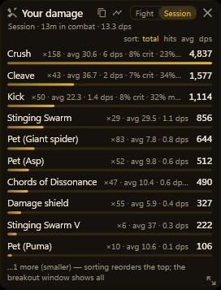 |
| **Mini mode** — a one-line pill of your starred stats plus live watch-rule chips; alerts still pop | **Breakout windows** — floating bar charts for your damage, healing, and pet, per fight or per session |
| 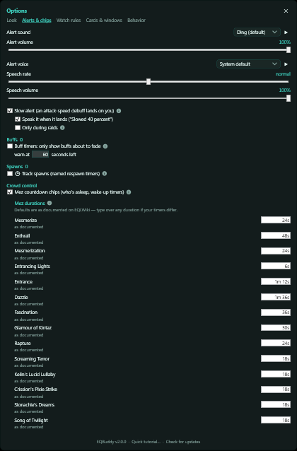 |  |
| **Options, now in tabs** — Look · Alerts & chips · Watch rules · Cards & windows · Behavior. The alerts tab shown: the 🐌 slow alert (with its spoken voice and raid-only mode) and the buff-timer display controls | **See-through mode** — the panel fades, the text stays sharp; with click-through on, the game gets every click |
|  |  |
| **The Zone map is now the Map tab of the World window** (right-click → *World…*, or the World card) — classic map packs with your `/loc` marker, a comet-tail breadcrumb trail, and **spawn-point circles** learned from your own kills; every running spawn timer shows in the side panel **and** as a camp pin with its countdown. *This capture predates the World fold: the map is what you still get, its window chrome is not.* | **The Travel route is now the Path tab of the World window** — hop-by-hop directions from where you stand to any zone, from the same graph that sorts quests by distance. *This capture predates the World fold: the route is what you still get, its window chrome is not.* |
|  |  |
| **Spawn-point circles, up close** (on the World window's Map tab) — named spawns wear the theme accent *with their name beside them* (a running timer's camp pin takes over with a countdown, like Bloodgurgler here); trash camps sit dim; circles pulse when a respawn is due within ten seconds. All learned from your own kills near your own `/loc`s — this is real Crushbone data | **Share zone knowledge** (the door is on the World window's Map tab) — a zone's spawn points and timers as one paste-safe string; imports preview every change first, and a timer far off the zone's known clock arrives flagged |
|  |  |
| **Cursor ring** — a click-through halo that rides your pointer, for everyone who's ever lost the tiny cursor mid-fight | **Send feedback** opens a pre-written GitHub Discussion for your review — most of the features on this page started as one |
|  |  |
| **EQBuddy Mobile on a tablet** — the zone map with your spawn-point circles, camp pins, and the Named list beside it: every running timer, its countdown, and where its camp came from (`📍` your own `/loc` at kill, `~` the wiki, or "no camp yet"). Tap a spawn point to confirm or remove it — the PC's map updates as you do | **…and on a phone** — the same page, laid out for one hand. Each device picks which windows it shows and in what order, so the tablet propped beside you and the phone in your pocket show different things. This is real Splitpaw data over a home Wi-Fi |

## For players (install guide)

> **Windows security note.** EQBuddy is now signed with a **publicly trusted
> certificate** (Azure Artifact Signing). The publisher reads
> **"FlossworksCross-Stitch"** — that's David's small business, which funds the
> certificate personally, and yes, he also cross-stitches. The "unknown publisher"
> prompt is gone.
>
> SmartScreen may still warn for a while yet. Reputation is built per publisher and
> it accrues over downloads and time, so a brand-new certificate starts at zero no
> matter how legitimate it is; single-file installers are also exactly what Defender's
> heuristics are tuned to distrust. Expect the warnings to fade over the coming
> releases rather than vanish overnight. You don't have to take our word for any of
> it:
>
> - The **full source code is public** in this repository — what you see is what gets built.
> - Every release publishes a **SHA-256 hash** (`EQBuddySetup.exe.sha256`) beside the
>   installer. Verify your download in PowerShell with
>   `Get-FileHash -Algorithm SHA256 EQBuddySetup.exe` and compare — a match means you
>   have exactly the published file. (EQBuddy's own auto-updater refuses any download
>   that fails this same check.)
> - Prefer no installer at all? Use **EQBuddy-portable.zip** from the same release —
>   unzip and run.
>
> If Defender quarantines the file, restore it and add an exclusion only after the
> hash check passes.
>
> **Quality, concretely.** Every push runs 1,152 automated tests — 1,107 on the
> parser, stats, and shared logic plus 45 headless render tests of the Avalonia
> UI — on both Windows (WPF + Avalonia) and Ubuntu (Avalonia + Core), and a
> release doesn't ship until it has passed CI and been played against a real
> session by the maintainer. CI workflows are pinned to exact commit SHAs and
> run with read-only permissions by default. What the app touches on disk and
> on the network — all of it — is written down in [SECURITY.md](SECURITY.md).
>
> **How to check the signature yourself.** Right-click `EQBuddySetup.exe` →
> **Properties** → **Digital Signatures**. It should name FlossworksCross-Stitch and
> chain to a Microsoft certificate authority. If it doesn't, you did not get the file
> we published — don't run it.

1. Run **EQBuddySetup.exe** and click through the installer (no admin needed).
2. Launch **EQBuddy** from the Start Menu or desktop shortcut. A **quick tutorial**
   walks you through the key features — its first page asks whether EQBuddy may
   auto-empty finished-session logs (say no if you upload logs elsewhere; nothing is
   touched until you answer). Reopen it any time: right-click → **Quick tutorial…**
3. Start EverQuest Legends and log into your character.
4. Play! The widget updates live. Click a section (Combat, Kills, Loot, …) to expand details.
   - EQBuddy turns the game's logging on permanently (it sets `Log=1` in `eqclient.ini`
     whenever the game isn't running), so you normally never need to type `/log`.
   - The dot in EQBuddy's corner turns **green** when it's receiving data. If it's red
     with a yellow banner during play, type `/log` in the game's chat as a one-time fix.

> **Playing on a Mac through CrossOver/Wine?** The Windows build runs in a bottle, but
> a fullscreen game will paint over the widget — a Wine-on-macOS quirk, not an EQBuddy
> bug. An opt-in setup fixes it so the widget floats over the fullscreen game (and
> clicking it doesn't disturb the game or pop the Mac menu bar): see
> [docs/CrossOver-macOS-overlay.md](docs/CrossOver-macOS-overlay.md). It does nothing on
> Windows or unless you turn it on. (A native Mac 1.x `.app` still ships on current
> releases — see [LEGACY-V1.md](LEGACY-V1.md) for how that line is preserved.)

Mini dashboard:
- Click the **★ star** next to any section header to include that stat in the mini dashboard.
- Click **–** in the title bar to minimize: only your starred stats remain, in a tiny
  always-on-top pill (e.g. `💀 12  ⚔ 34 dps`). Great while actually fighting.
- Double-click the pill (or click ⤢) to expand back to the full view.
- **Breakout windows**: while minimized, the ⚔ dps, ✚ hps, and
  🐾 pet stars each open a small floating bar chart — your damage, your healing, and
  your pet's damage by ability — switchable between the **current fight** and the
  **whole session**. Drag them anywhere (positions are remembered); ✕ hides one until
  you next minimize. The 🐾 pet star sits at the top of the Combat card beside the dps
  star and also adds a pet-dps chip to the pill.

Updates (automatic):
- EQBuddy checks for new releases at startup and every 6 hours, and a green banner
  appears when one is available — click it to open the download page.
- Right-click the widget → **Check for updates** to check on demand.
- After an update, a one-time **"What's new"** popup shows the notable changes —
  including every version you skipped.
- Nothing is sent anywhere: the check is a read-only request to the GitHub Releases API.
- *Optional, for guilds and LAN setups:* point `UpdateFolder` in
  `%AppData%\EQBuddy\settings.json` at a shared folder holding `EQBuddySetup.exe`, and
  EQBuddy will install from there silently and restart itself instead of sending you to
  GitHub. The published `EQBuddySetup.exe.sha256` is verified before anything runs.

Log cleanup, splitting, and archive review:
- **Nothing is thrown away.** Since 1.84.0, *"Keep a timestamped copy before emptying"*
  is **on by default**, so every finished session is saved to `Logs\archive\` as
  `eqlog_<name>_<server>_<STAMP>.txt`. EQBuddy never deletes anything in that folder —
  it's yours to keep or clear on your own schedule. Each archive announces itself with
  a banner and a line in `error.log`, so you can tell it happened without going to look.
- Because logging is always on, EQBuddy then empties any character log that has been
  quiet for 60+ minutes (a finished play session), so files never grow across sessions.
  Cleanup runs at EQBuddy startup and every 10 minutes — but never while the game is open.
  Don't want it emptied at all? Untick *"Clean up finished session logs"* in ⚙ Options.
- The **↻ Reset button splits on demand**: everything so far *moves* to the archive and
  a fresh log starts immediately, mid-play — ideal for "one file per raid". It asks
  before it does that, and its tooltip names the file operation, because a button
  labelled "reset stats" shouldn't quietly touch a file on disk (#159, Frankthetankk).
  With archiving turned off, ↻ leaves your log alone entirely and only clears the numbers.
- **Review any archived log**: right-click → *Review an archived log…* replays a
  saved file read-only. The title bar turns amber while you're in the past; one
  click returns to live. Drops by Creature and ✦ Copy for wiki work against the
  reviewed session, and a file holding several sessions asks which one you meant.
- If you keep your logs — because you also run **GINA or GamParse**, or upload to
  another parser — turn off **"Auto-empty finished-session logs"** in ⚙ Options; EQBuddy
  then never touches your log files (they'll grow forever, so clean them up yourself
  occasionally). Cleanup also stands down automatically whenever the game, GINA, or
  GamParse is running, so those tools' log positions are never yanked out from under
  them.

Watch rules & alerts — see the **[full Watch List guide](docs/WatchListGuide.md)** with
screenshots and a use-case cookbook for every rule kind:
- ⚙ Options → **Watch rules**: add simple match texts (e.g. `mote`) — the 🎯 Tracked
  card shows every matching item name, quantities, and per-hour rates (wall-clock and
  active-play). 📌 pins a chip to the mini dashboard; 🔔 and the sound box fire a
  focus-safe banner and/or sound the moment a matching item drops. A rule has a short *name* and a
  *match text* — if you only fill in the name, it doubles as the match text, so
  typing just `Ghoul` on a Kill rule works. The alert banner is a **floating tile**
  you position anywhere (open Options and drag it); during play it's click-through
  and never steals focus, so it can sit right over the action.
- **Every rule gets its own sound — and its own color.** The sound box on each rule
  offers seven built-ins (Ding, Notify, Chimes, Chord, Tada, Exclamation, Alarm), your
  own `.wav`/`.mp3` via **Custom…**, **Default** to follow the shared choice, or **Off**.
  Give your charm-break rule one sound and your rare-drop rule another and you'll know
  what happened without looking away from the game. Picking a sound plays it straight
  away. The **● color dot** beside the 🔔 cycles a seven-color palette for the banner —
  mez purple, heals green, enemy red — so alerts read at a glance even with the sound
  down. When several alerts fire in the same moment, one sound plays (complete, no
  cut-offs), and an alert about one creature never silences the same alert about a
  different creature seconds later.
- **Watch any text in the log.** Most rule kinds match things EQBuddy understands (loot,
  kills, skill-ups, deaths, milestones, spells wearing off). The **Log text** kind matches
  the raw line instead, so you can alert on anything at all — a raid-assist script calling
  a Complete Heal chain, a server's custom emotes, your guild's own chat conventions.
  Nothing EQBuddy has to recognise in advance. Empty match text matches nothing (a
  match-everything text rule would alert on every line in the log), and lines are only kept
  while a text rule is enabled and watching for them.
- **Delay an alert to turn it into a cue.** Each rule has a *delay* box, up to 30 minutes
  (seconds by default, `m` for minutes). Match the call in a complete-heal chain and sound
  2.5 s later to say "cast now"; sound 25 s after your mez to say "recast it"; or put `8m` on
  a Kill rule and you have a camp timer for the placeholder you just killed. Only the alert
  waits — counts update immediately. Want both an immediate and a delayed alert? Make two
  rules with the same match text and different sounds: a quiet "heard it" now, a loud "do it
  now" later. Short cues are dropped if you die (a reminder to cast is noise once you're
  dead); timers over a minute survive it, because dying doesn't change when a mob pops.
- **Regex when you want it.** The `.*` toggle beside any Match box treats it as a
  full .NET regular expression — `CH (-->|on) Tank` catches both spellings of a raid
  call in one rule. Case-insensitive like the plain mode; an invalid pattern matches
  nothing and explains itself in the box's tooltip; a runaway pattern is cut off at
  100 ms so log tailing never stalls.
- **Spoken alerts** (contributed by dandrews2930). The **S** toggle reads the alert
  aloud — "Spirit of the Puma faded off you" — with duplicate lines suppressed so a
  chain of fades doesn't chant at you. A rule can ding, speak, both, or neither.
  Speaks with the Windows voice, and on macOS too (that side contributed by quasarj);
  on Linux the toggle says so honestly instead of pretending.
- **Share rules as text.** The ⤴ on any rule copies it as a compact `EQB1` string
  sized for guild chat; the import box turns one back into a rule — with a preview of
  exactly what it does before you accept, rebuilt field by field so a share string
  can never do anything the editor couldn't.
- Stats show **recent-window rates** ("Last 15m") alongside session averages — pick 5,
  15, or 30 minutes in Options — plus per-active-hour rates that ignore downtime.

Spawn timers (on by default):
- Kill a named — or its known **placeholder** — and a small **countdown chicklet**
  appears: a stopwatch, the name, and the time left — `Asaka L`Rei 3:12`. Chicklets
  stack, drag anywhere as one, keep counting
  **every timer you have running in any zone**, survive an app restart, and flip to a
  **DUE** badge at zero (with a sound, if that named's bell is on) for one minute before
  tidying themselves away — click sooner to dismiss.
- **Double-click a chicklet** (or right-click → **Spawn timers…**) for the full zone
  list, which follows you zone to zone (pick another zone from the dropdown to plan
  ahead; Follow snaps back when you actually zone). Every respawn time is editable in
  place, ▶ starts a timer by hand for camps you arrived at late ("died 5m ago"), and
  **+** adds named the catalog doesn't know. Turn tracking off with **Track spawns**
  in the menu or ⚙ Options.
- **Timers tighten themselves as you play**: re-kill a named sooner than its timer
  claimed possible and EQBuddy adopts the observed gap (your own typed values are
  never touched). The shipped catalog seeds the numbers; your kills correct them.
- EQ Legends' difficulty tiers ("Befallen 4 (Refined)") resolve to their base zone's
  named list automatically.
- Ships with **840+ named across 118 classic zones**, seeded from the
  [EQ Legends community wiki](https://eqlwiki.com) with classic-EQ references filling
  gaps. These are community numbers, not game data: **every duration is editable in
  place** (`22` = minutes, `90s`, `12h`, `3d`, `6:40`), your edits persist through
  updates, and you can add named the catalog doesn't know. Named with no documented
  timer fall back to their zone's default cycle.
- When a countdown hits zero the row and its chicklet flip to **due**, with an
  optional sound (per-named 🔔 toggle; sound off by default — the chicklet is the
  visual). A timer that expired while EQBuddy was closed shows as due without
  re-alerting at startup.

Mez timers (crowd control you can trust):
- Land a mez and a **crescent-marked chip** counts down until the target wakes (a slow
  wears a debuff arrow, a spawn timer the stopwatch — one mark per kind, so a stack of
  mixed chips reads at a glance) — numbered separately
  for same-named mobs ("orc pawn (2)"), warning tint in the final seconds, draggable as
  a stack. The log never states mez durations, so EQBuddy **learns them from your own
  fades**: the gap between landing and a clean wear-off becomes that spell's clock, and
  rank upgrades re-teach it on the next honest observation.
- Breaks are read from the game's own mouth first: the **"X has been awakened by Y."**
  line drops exactly one chip, and a same-named add that *resisted* your AE mez is
  known to be awake — so its flailing never eats the chip of the sibling you actually
  mezzed (built from a player's 2,800-line Plane of Hate log, discussion #122).
- The built-in **"CC broke" rule** alerts the moment a mez, charm, root, or stun on
  *your* target ends early — with the mob's name, so you know who's loose.

Encounters, mob farming, and stances:
- Combat shows your **recent fights** (creature, duration, per-fight DPS) and, when your
  class uses stances, a **By stance** breakdown of damage, combat time, and DPS with the
  current stance named in the summary.
- Kills shows **per-creature farming**: average fight length, coin, and XP per creature,
  plus each creature's observed drops with your personal drop % (the History window
  shows the full x/y kill counts behind each rate — these are your rates, not the game's).
- Watch rules aren't just loot anymore: a rule can watch **Loot, Kills (creature name),
  Skill-ups, Deaths, Milestones** (levels/AA), or **SpellFade** — your spells wearing
  off — either one named spell or a whole class (**Any CC**, Charm, Mez, Root, Lull,
  Stun, **HoT**), which needs no match text and keeps working as you level into new
  spells. The class filters know **every crowd-control spell in the game** — 174 from
  a full eqlwiki sweep (the game has 87 stun spells alone) — so enchanter stuns like
  Color Flux count the same as a classic Root. HoTs are recognised from their own tick
  lines, so the filter covers heals EQBuddy has never seen before. **Buff fades count too**: EQBuddy knows the wear-off
  flavor lines ("Your speed returns to normal." is your haste dropping) and fires
  your fade rules even though the log never names the spell. A charm-break alert is
  on out of the box. Same counters, chips, and alerts for every kind.
- History window: **Ctrl-click two sessions to compare** their rates side-by-side, and
  **Import log…** parses any old eqlog file into your session history.

Maps & travel:
- **Zone map** (right-click → *Zone map…*): drop a classic map pack into the game's
  `maps` folder and EQBuddy draws your zone — following you as you zone, wheel to
  zoom, drag to pan. The map window's **Get maps…** button takes you straight to
  [Brewall's EverQuest Maps](https://www.eqmaps.info/eq-map-files/) (unzip the pack
  into `maps`, next to `Logs`); any classic-format pack works. Type `/loc` in game and your position appears
  as a marker, honestly labeled with how old it is: EQBuddy reads only the log, so
  the marker moves when you ask it to, not by magic. Make a `/loc` hotbutton and tap
  it as you travel — each one adds to a **comet-tail breadcrumb trail** of your last
  minute of movement, each crumb fading continuously from the moment it lands, so the
  map shows where you just came from without ever cluttering into a route history.
- **Spawn-point circles**: every kill that lands near a fresh `/loc` becomes a
  spawn-point observation, and the map draws each point as a circle — named spawns
  in your theme's accent, ordinary camps dim — clustered, refined, and saved to a
  **per-zone archive that only gets better the more you play**. Hover a circle for
  the mobs seen there (with kill counts), the last kill, and the projected respawn
  from the zone's own clock; a circle **pulses when a respawn is due within ten
  seconds**. Multi-spawn named (Crushbone royal guards, we see you) show every point
  they've actually died at. Wrong dot? **Right-click a circle to remove it** — the
  removal sticks across restarts, and new kills near the spot honestly re-learn it.
  Right dot? **Right-click to confirm the location** — it stops drifting toward new
  kills, holds where you attested it (marked with a small center dot), and the
  confirmation travels when you share the zone. Whole zone gone stale?
  **Right-click empty map space → Reset** wipes the zone's archive (with an
  are-you-sure showing the count) and it learns fresh from your next kills.
- **Share zone knowledge** (map window, bottom of the named panel): export a zone's
  spawn points and timers — learned ones and ones you typed alike — as one
  paste-safe `EQBZ` string for a friend, or
  import theirs — with a **full preview first**: every new point and timer change is
  listed, and a timer that strays far from the zone's established clock arrives
  **flagged** and applies only if you explicitly say so. Want everyone to benefit?
  **Submit to EQBuddy** opens a prefilled GitHub Discussion with your string — you
  post it under your own account, it's reviewed in the open, and good data ships in
  a future release with credit. Nothing is ever sent by the app itself.
- **The forager's trick** makes `/loc` near-automatic without addons: create an
  in-game social with `/loc` on line 1 and `/doability 1` (Forage, Sense Heading,
  Kick — whatever you already spam) on line 2, and put it on that skill's hotbar
  key. Every press drops a breadcrumb while doing exactly what the key did before —
  the same move foragers used for twenty years. Better still, bind that hotbar
  slot to a **movement key you tap a lot** — the turn/strafe keys (`A` and `D`)
  are the sweet spot, because every course adjustment drops a crumb and the trail
  draws your route hands-free. (`W` works too, but held keys don't repeat — it
  only fires when you start moving, so a long straightaway leaves no crumbs.)
  Either way it's a plain game social — the game runs it, EQBuddy just reads the
  log, and doesn't mind however many `/loc`s you produce.
- **Named camps, pinned**: every running spawn timer in your zone appears in the map's
  side panel with its countdown — and a 📍 pin on the map itself once EQBuddy knows the
  camp: your own `/loc` near the kill teaches it (type `/loc` during the fight and the
  next kill pins it), with the wiki's location field as fallback. Spawn timers, camp
  positions, and your own route on one screen — ShowEQ's greatest hits, rebuilt from
  nothing but your log and public wiki pages.
- **Travel route** (right-click → *Travel route…*): pick any zone and get hop-by-hop
  directions from where you're standing — walking connections from client-mined atlas
  data plus the wiki's boat and port adjacencies.

Quests (tracker, Sky checklist, ledger):
- **Quest Tracker** (right-click → *Quest tracker…*): 1,100+ quests from the community
  wiki, filterable by class, era, and zone — sorted by how many zones away each quest
  giver is from where you're standing. **Type anything in the search box** and the
  whole catalog answers — quest names, turn-in items ("what needs Bone Chips?"),
  rewards ("what gives a Ghoulbane?"), quest givers, zones — with progress and a 📌
  to track any result. A **quest ledger** counts what you loot (minus
  what the log sees leave — sales, merges, destroys), so a quest flips to **✓ ready**
  the moment you hold everything it needs; hand-ins aren't in the log, so click ✓ when
  you turn in. Click a quest name for the full wiki walkthrough.
- **Plane of Sky checklist**: all 222 Sky turn-in items (contributed by dandrews2930).
  It used to be its own overlay card with a tab per class; **it is now the Plane of Sky
  tab of the Quest Tracker**, filtered by a class chip strip. Loot auto-checks boxes for
  the classes you play, a **Ready to turn in** block leads with what you can hand in right
  now, and each reward line is its own "I turned this in" checkbox — completed quests dim
  their items and stay done across restarts.
- **The accuracy contract.** Quest data mirrors [eqlwiki.com](https://eqlwiki.com) —
  EQBuddy is exactly as accurate as the wiki is, no more and no less. We hold up our
  half: every quest's turn-in items are **verified item-for-item against the live
  wiki** (the audit script ships in `scripts/harvests/`, last full run found 917/917
  clean), and sanity gates run on every weekly catalog refresh so a bad harvest
  can't merge. When something still looks wrong, the ⚑ on any quest card opens a
  prefilled report — and if the *wiki page* is what's wrong, editing the page fixes
  every EQBuddy install on the next weekly refresh. The road runs both ways: your
  own play feeds the wiki through **✦ Copy for wiki** (drops the wiki doesn't know,
  marked in red) and `/consider` level observations.

Target drops, item info & giving back to the wiki:
- **While you fight, the Loot tab of the Gear & Loot card shows what the creature can drop** — wiki knowledge
  from [eqlwiki](https://eqlwiki.com) merged with your own session: items you've seen
  drop lead the list with `2 this session · 67%` (your kill count is right in the
  header, so the percentage is honest), wiki-only drops follow with their rarity.
  Hover any item for its stat block; click for the full **Item info** popup — stats,
  vendor value, who drops it, who sells it, what quests want it. Everything is cached
  for a week and labelled LIVE / CACHED / STALE so you always know how fresh it is.
  Toggle the block off in ⚙ Options if you prefer a lean Loot tab.
- **Drops by Creature** (the **Drops** tab of the **Kills & Drops** card — it moved there
  from Gear & Loot on 2026-08-21, because Gear & Loot is about your bags and Drops is about
  the mob) is the review table behind it all: every
  creature you've killed with your observed drop rates, exportable as text or CSV. An
  amber **✦** marks drops the wiki doesn't know yet, and **✦ Copy for wiki** builds a
  paste-ready contribution in the wiki's own house style — per-creature edit links, an
  observed stat block (zone at kill time, money range, faction hits, `/consider` level
  range), and rarity labels only when your kill count can honestly carry them. Nothing
  publishes automatically: you review and save on the wiki. The same loop runs the
  other way — EQBuddy's quest and spell knowledge refreshes itself from wiki changes
  weekly, so community edits reach the app without anyone re-typing them.

Feedback:
- Right-click → **Send feedback…** — pick *Feature request* or *Bug report*, type your
  note, and EQBuddy opens a pre-written GitHub Discussion in your browser for you to
  review and post under your own account. **Nothing is ever sent by the app itself**;
  the only context appended is the app version and Windows build. This loop is how
  most of the features on this page got built — often the same day they were asked for.

Session history (automatic):
- Every meaningful session is saved to a local SQLite database
  (`%AppData%\EQBuddy\history.db`) — no uploads, nothing manual. Sessions end and save
  when you go quiet for 60+ minutes, switch characters, or close EQBuddy; the active
  session checkpoints every 5 minutes so a crash loses almost nothing.
- ⚙ → **Session history…** opens the browser: filter by character, search anything
  (zone, loot, creature names, notes, tags), view the full per-session breakdown, add
  notes/tags, copy a shareable summary, export JSON, or delete.

Click-through, overlays & window control:
- Right-click → **Click-through**: game clicks pass straight through the widget (border
  turns amber). A small **🔒 chip** appears beside it — click the chip to interact again.
  Works on Linux too (X11).
- **Grid overlay**: a faint click-through grid over your whole desk for lining up game
  UI elements — stronger lines every fourth square, spacing slider in Options.
- **Cursor ring**: a click-through halo riding your pointer for everyone who's ever
  lost the tiny cursor mid-fight. Both toggles live in the right-click menu and
  survive restarts.
- **Two ways to resize**: the corner grip scales *everything* (text included, 80–160%),
  and dragging the **bottom edge** makes the widget taller or shorter without touching
  text size — double-click the edge to go back to fit-the-screen. **Ctrl + mouse
  wheel** zooms any other EQBuddy window, remembered per window.
- *Global hotkeys were removed in 1.34*: they registered system-wide and swallowed
  common shortcuts like `Ctrl+Shift+T` (reopen browser tab) from every app on the
  machine — a player caught it, and the right fix was removal. Everything they did is
  reachable from the widget itself: **–** for mini mode, the right-click menu for
  click-through and camp markers.
- ⚙ Options → **Overlay cards**: reorder cards and hide the ones you don't want —
  hidden cards keep collecting data.

Custom install locations:
- EQBuddy finds the game via the installer's registry entry, so non-default install paths
  are usually detected automatically. If yours isn't, **right-click the widget →
  "Choose log folder…"** and pick the game's `Logs` folder (picking the install folder
  itself also works). "Auto-detect log folder" reverts to automatic detection.

Notes:
- The title bar shows which character EQBuddy is following. It always tracks whoever is
  actively playing (the log file that's currently growing) and switches automatically
  within a few seconds when you swap characters.
- The ↻ button clears the session and starts counting from now.
- The widget always stays on top of the game. Drag anywhere on it to move it;
  its position is remembered.
- ⚙ (or right-click) → **Options…** has a **theme** picker (Parchment & Brass, Blue Grey,
  Turquoise, Redish, Grey, Solarized, Solarized Dark — the theme system was contributed
  by ahaselden) and sliders for widget size (scales
  everything, fonts included, 80–160%), background see-through (only the panel fades — text
  stays sharp so you can watch the game through the widget), and whole-widget opacity.
  Changes apply live — the theme repaints open windows instantly — and are remembered.
- Loot that the game auto-sells on pickup counts as both loot and merchant income.
  Selling straight from the **advanced loot window** is captured too, credited to the
  item named on the game's "destroyed" line. The log always records which corpse an
  item came from (even when the advanced loot window hides it), so per-creature drop
  rates work regardless of how you loot.
- A "session" is a contiguous stretch of play. After 60+ minutes of no log activity,
  the next activity starts a fresh session automatically.

## EQBuddy Mobile (beta)

Your phone or tablet, as a second screen for EQBuddy. Click the **📱 button in the title
bar**, and EQBuddy shows a QR code; point the device's camera at it and its browser
becomes a live view of your session. There is nothing to install on the device, and the
pages ship inside `EQBuddy.exe`, so they update when EQBuddy does.

Eleven screens are available — zone map, spawn timers, mez chips, buffs, combat
breakdowns, session stats, loot & watches, XP & AA, and your Epic, Sky and Gear
checklists. **Each device picks which of them it shows, and in what order** (the ⚙ on the
device), so a tablet propped beside the keyboard and a phone in your pocket can show
completely different things. On a tablet the zone map gets the Named list beside it; tap
a spawn point to confirm, un-confirm or remove it, and the PC's own map updates with you.
Checklist rows tick from the device too.

**Privacy and safety, plainly:**

- **Off until you turn it on.** A fresh install opens no port at all.
- **Your network only.** EQBuddy serves the pages straight to your device over your LAN.
  No account, no cloud, no telemetry — nothing leaves your network, and there is no
  server anywhere for it to leave *to*.
- **You choose what may be sent.** Options → Behavior → EQBuddy Mobile has a checkbox per
  screen; an unticked screen is never even built, let alone transmitted.
- **Pairing is revocable.** The code travels in the URL *fragment*, so it never appears in
  an HTTP request; "New code" instantly locks out every device you have paired.

**Things that will bite you, so you know up front:**

- **Windows Firewall** asks to allow EQBuddy the first time you switch it on. If you
  dismiss that prompt, devices simply can't connect and nothing will say why — switch
  EQBuddy Mobile off and on again to get the prompt back.
- **Guest or public Wi-Fi** that isolates devices from one another will block it. So will
  having the PC and the device on different networks (a 5 GHz guest SSID counts).
- **Your screen will sleep.** Browsers won't hold a screen awake over plain HTTP, even
  from a Home Screen launch, so raise your device's screen timeout if you're camping.
- The **breadcrumb trail** is the last minute of movement, and it only moves when a `/loc`
  reaches the log — the map window's ⧉ button copies a social that makes that one keypress.

## How DPS is measured

Session DPS = your damage ÷ time actually **in combat**, so downtime never dilutes it.

- **Your pet counts — summoned or charmed.** EQBuddy learns your pet's name from its
  "Attacking X Master." chatter and credits its melee and spell damage to you (shown as
  "Pet (Name)" in the damage breakdown). Pet kills count as your kills. A charm landing
  ("an asp blinks.") claims the creature provisionally — its damage shows as
  "Pet? (Name)" until a Master message confirms it, then merges into "Pet (Name)".
  If a pet ever damages you (charm broke), it stops being credited. A **Pet abilities**
  list under the damage breakdown splits that row by what the pet used — melee skills and
  the spells the log names — so you can see what it is actually doing, per fight and per
  session. Star the paw at the top of the Combat card and the pet gets its own breakout
  window while minimized.
- The combat clock opens when *you* act — hit, miss, pet attack, or getting hit — and
  stays open while your group keeps fighting, so slow-swinging melee and casters between
  casts aren't penalized mid-fight.
- Others' fighting only keeps your clock running for ~20 s past your last action:
  tagging one mob doesn't charge you for the whole group fight, and idle time in a busy
  zone never counts. The clock closes after 10 quiet seconds.
- The Combat detail view shows total time-in-combat so you can see the denominator.

## What it tracks

| Section | Summary stat | Click-in details |
|---|---|---|
| Combat | Session DPS (+ live fight DPS) | Details!-style damage breakdown per attack/spell/song — every row shows total, hits, average, **per-ability DPS** (that ability's damage ÷ time in combat — its contribution rate; burst rate in the tooltip), and crit rate; sortable by total/dps/hits/avg with the bar following the sorted column; accuracy, melee avoidance %, biggest hit, time in combat, damage taken per mob — self-inflicted damage (HP-cost casting, falls, drowning) shows as "Yourself" and never counts as being in combat — recent fights with DPS bars, fizzles/resists |
| Healing | HPS (healing ÷ time in combat) | Healing done and received — including heal-over-time ticks ("healed you over time for…"), which carry real amounts — heals cast per spell with the same breakdown as Combat (total, casts, average, **per-spell HPS**; sortable by total/hps/casts/avg with matching bars), who healed you, hymn/regen tick counts (the log gives no amounts for those) |
| Kills | Your kills incl. pet (+ group kills) | Count per creature type, kills/hour, group-member kill counts; per-creature farming: avg fight length, coin, XP, and observed drops with your personal rate (e.g. `×2 · 22%`) |
| Loot | Items looted (+ items made) | Every item with counts (hover for stats, click for wiki item info), items created by merging, and *(new, beta)* live **target drops** for the creature you're fighting |
| Money | Coin earned (p/g/s/c) | Corpse coin vs merchant-sale income, items sold with prices, biggest drop, money per hour |
| Progress | XP % gained (+ levels, + AA) | XP ticks, %/hour, AA points gained with AA/hour, estimated time to next level, level-ups with times, skill-ups per skill, and *(new, beta)* every **AA ability you own** with its rank and what it does (hover for the wiki effect text) — remembered per character even after log cleanup |
| Faction | Factions touched | Net standing change per faction; a standing at the cap shows **maxed** (or `+120 · maxed`) instead of silently freezing |
| Travels & Deaths | Death count | Each death (what killed you, when), zones visited with times |

## For developers

- `src/EQBuddy` — WPF app (.NET 10, `net10.0-windows`). Build on Windows:
  `dotnet build src/EQBuddy/EQBuddy.csproj -c Release`. From non-Windows machines,
  add `-p:EnableWindowsTargeting=true`.
- `src/EQBuddy.Avalonia` — the 1.x cross-platform Avalonia app (.NET 10), created and
  maintained by [Don Thompson](https://github.com/DonThompson) (thanks, Don!) —
  including the X11 click-through implementation. It remains in the tree and on
  current 1.x releases; Evolved (v2) is Windows-only — see [LEGACY-V1.md](LEGACY-V1.md).
  A linux-x64 build is attached to current GitHub releases.
  Build: `dotnet build src/EQBuddy.Avalonia/EQBuddy.Avalonia.csproj -c Release`.
  It also builds and runs on macOS with no extra dependencies (the .NET 10 SDK is
  enough), which is useful when the game itself runs under a Windows compatibility
  layer. The macOS features — click-through (`ClickThrough.cs` dispatches to X11
  input shapes or NSWindow `ignoresMouseEvents`), spoken alerts (`say`), and
  Wine/CrossOver/Whisky log-folder auto-detection — were contributed by
  [quasarj](https://github.com/quasarj) (PR #90; thanks!). Releases attach
  **`EQBuddy-osx-arm64.zip`** (Apple Silicon) and **`EQBuddy-osx-x64.zip`** (Intel)
  alongside the Linux tarball. Each unzips to `EQBuddy.app` — drag it to
  Applications and open it like any Mac app (thanks to
  [pmcginn](https://github.com/pmcginn), discussion #157, for pointing out that the
  old loose-files tarball gave a new Mac user nothing obviously openable).
  They're unsigned — **first launch needs right-click → Open** (not a double-click),
  or `xattr -dr com.apple.quarantine EQBuddy.app`.
- `src/EQBuddy.Core` — shared parser, watcher, settings, update, and session-stat logic.
  Both UI projects reference this; UI-independent code goes here.
- `src/EQBuddy.Core/LogParser.cs` — one regex per log-line type; add new patterns here.
- `src/EQBuddy.Core/SessionStats.cs` — aggregation + DPS fight tracking + session rollover.
- `src/EQBuddy.Core/LogWatcher.cs` — file tailing (500 ms polls, offset-based, truncation-safe).
- `src/EQBuddy.Core/EqConfig.cs` — log hygiene: forces `Log=1` in eqclient.ini and truncates
  stale (60+ min quiet) logs; both are skipped while `eqgame.exe` is running.
- Publish: `dotnet publish -c Release -r win-x64 --self-contained -p:PublishSingleFile=true -o dist/publish`
- Release: `scripts\release.ps1` — reads the version from `Directory.Build.props` (the
  single source for every project), publishes, signs both exes (Azure Artifact Signing —
  see `scripts\signing.ps1`), compiles the installer with the matching version
  stamp, and copies the artifacts to the update channel. Pass `-Tag vX.Y.Z` to push,
  tag, and publish a GitHub release (CI attaches the Linux tarball and the macOS
  `.app` bundles). Bump `<Version>`
  in `Directory.Build.props` and add a `WhatsNew.json` entry first — the script refuses
  to release without one.
- Knowledge refresh: wiki-derived catalogs (quests, fade messages, zone graph) refresh
  weekly via `.github/workflows/knowledge-refresh.yml`, which runs
  `scripts/harvests/refresh.py` (incremental, RecentChanges-driven) and opens a review
  PR with the delta. Curated catalogs (spawn timers, AAs, CC lists) are never
  auto-written — the PR only flags them.
- Settings live in `%AppData%\EQBuddy\settings.json`; errors in `%AppData%\EQBuddy\error.log`.
- Debug: set `EQBUDDY_EXPAND=1` to launch with all sections expanded plus a state dump
  in `%AppData%\EQBuddy\debug.txt`. Set `EQBUDDY_APPDATA=<dir>` to run against an
  isolated profile (settings, history, logs) without touching your real data. More
  hooks in the same family: `EQBUDDY_DROPS=1`, `EQBUDDY_QUESTS=1`, `EQBUDDY_OPTIONS=1`
  open those windows at launch; `EQBUDDY_REVIEW=<file>` (plus optional
  `EQBUDDY_REVIEW_SESSION=<n>`) opens straight into archive review.

Log folder auto-detected at
`C:\Users\Public\Daybreak Game Company\Installed Games\EverQuest Legends\Logs`
(`eqlog_<Character>_<server>.txt`), or wherever the installer recorded it in the
registry. On macOS the game runs under a Windows compatibility layer, so the same
path is searched inside each Wine prefix it can find: `$WINEPREFIX`, osxEQL, every
CrossOver bottle, every Whisky bottle, PlayOnMac, and `~/.wine`. When more than one
turns up, the install whose character log was written most recently wins — a prefix
you have stopped using keeps its (empty) `Logs` folder forever, and existence alone
would let it outrank the one you actually play.

## Credits — who built this

EQBuddy is one person's widget that a lot of other people made good. Everyone below
either wrote code that shipped or handed over the one fact that turned a guess into a
fix. If you're missing from this list, that's a bug — open a discussion and it gets
corrected.

### Code

- **[Don Thompson](https://github.com/DonThompson)** — created and maintains
  **`EQBuddy.Avalonia`**, the entire cross-platform 1.x build, including the X11
  click-through implementation, and carried it through release after release of parity
  work. Linux and macOS exist because Don built them. Evolved is Windows-only;
  those 1.x builds stay downloadable — see [LEGACY-V1.md](LEGACY-V1.md).
- **[Liminal Warmth](https://github.com/liminalwarmth)** — the Wine font work that made
  text and icons render at all in a prefix (#148, #166), the opt-in macOS/Wine overlay
  that floats the widget over fullscreen EverQuest (#178), potion buffs in the buff
  tracker (#171, #179), spawn timers that survive tick gaps and stop learning a cycle
  from the wrong mob (#181, #201), loot provenance with the all/looted/other filter
  (#198), the mini-bar double-click gesture (#199), a **(Disabled)** alert sound (#200),
  and the breakout restyle with three live-found charm-tracking holes (#213).
- **[quasarj](https://github.com/quasarj)** — macOS support end to end (#90): click-through
  via NSWindow, spoken alerts through `say`, and Wine/CrossOver/Whisky log-folder
  auto-detection. Also `/pet leader` claiming (#92), window improvements (#103), Avalonia
  parity (#149), the CrossOver overlay script (#194), and the Buff Sets breakout and
  editor.
- **[dandrews2930](https://github.com/dandrews2930)** — the Plane of Sky checklist (#70)
  and its scrolling (#78), the buff fade picker and spoken alerts (#71), the EQ Legends
  Tools gear shopping-list import (#113), Sky turn-in NPCs and state counts (#127), and
  the Epic checklist (#128).
- **[ahaselden](https://github.com/ahaselden)** — the whole colour-theme system (#18) and
  its Avalonia half (#20), banner tints (#21), auto-download-and-install updates (#23),
  drag-the-corner resizing (#25), and rune absorption tracking (#54).
- **[theFlammHammer](https://github.com/theFlammHammer)** — socketed exaltations in the
  gear checklist, grouped and effect-aware (#134).

### Reported, tested, argued with, and corrected

Bugs get fixed fastest when someone attaches the log line, the screenshot, or the
achievements export. Several entries in the release notes exist because one of these
people did exactly that — and more than one of them talked me out of a wrong diagnosis
I had already published.

adndmike · AkevoTheBard · Amatyr · anyhow188 · aodgizmo · badly-developed ·
BenthamAutoIcon · Bigmatt500 · bjstrange · brucealeg · Chaosrah · chrstahl ·
crydeevisions-arch · DeusSilvam · elderbit · EzraSmith · Fedarov · Fennec-Halas ·
flclfool · Frankthetankk · gl_tchd · hstahl76 · Imaginary-Narwhal · jeremycranfill ·
jlcrisp · JoeyAlain · joeymavity · joma65 · Kemble-Kemble · KentCarmine · Kerdude ·
knaackville · KoboldCoterie · Ladylag · LeBigNasty · n3cr0nk1tt3n · pmcginn · rahvynn ·
sa-m3talh3ad · sahaq · sbaum23 · skwayb · Snagglefern · Taendar · Techsteps ·
TheLethean · themadpoet-dotcom · TheMegaSage · TropicMike · tvongaza · twidget76 ·
twill713 · typical-usual-chaos · Vellum670 · wizen

And the [r/EQLegends](https://www.reddit.com/r/EQLegends/) regulars whose threads shaped
features without ever becoming an issue number.

**Every player-visible fix names its reporter in
[What's New](src/EQBuddy.Core/Data/WhatsNew.json), with the discussion number.** That is
the durable record; this section is the roll call.

## License — use freely, credit visibly

MIT — see [LICENSE](LICENSE). Use the code, port it, build on it, ship your own
tool from it — freely, commercially, no permission needed. The license's one
condition (and it is a condition, not a request): the copyright notice comes
along with any substantial portion of the code you take. In practice, do it the
visible way: a **"based on [EQBuddy](https://github.com/DranakCorps-bot/EQBuddy)"**
line in your README or about screen, naming what you took.

Ideas — spawn timers that learn from your kills, the /loc breadcrumb trail, the
camp-pin map, the log-only principle — can't be licensed, and we wouldn't want
to: reimplement anything. But if EQBuddy's designs shaped your tool, say so by
name, the same way the credits above name everyone whose work shaped EQBuddy.

Contributions welcome; parser fixes go fastest when the issue or PR includes the
raw log lines involved.

Third-party credits are in [NOTICE](NOTICE). The original crowd-control spell seed list
is adapted from [Spyxy's DPS Meter](https://github.com/khadesh/SpyxysDPSMeter) by khadesh
(MIT) — thanks for making it open source. Spell, AA, spawn, item, and mob knowledge is
harvested from the [EQ Legends community wiki](https://eqlwiki.com) — the harvest data
and rerunnable scripts live in `scripts/harvests/`. Zone connections come from the
[eqltools.com Zone Atlas](https://eqltools.com/atlas). The zone maps themselves are
drawn from packs you install from the source — the in-app **Get maps…** button links
[Brewall's EverQuest Maps](https://www.eqmaps.info/), a quarter century of cartography
we point at rather than bundle: they're Brewall's to distribute, and the credit is
Brewall's to keep.

Two alert behaviors (per-target cooldown scoping and the first-sound-wins gate) were
inspired by designs in [EQ Legends Companion](https://jmoyers.github.io/everquest-companion)
by Josh Moyers ([source](https://github.com/jmoyers/everquest-companion)) — reimplemented
independently, since its license doesn't permit code reuse, but the ideas were his first
and they made EQBuddy's alerts better. More broadly, the whole read-the-log-and-nothing-else
approach stands on what [GamParse](https://gambosoft.eqresource.com) and
[nParse](https://github.com/nomns/nparse) proved across two decades of classic EverQuest.
