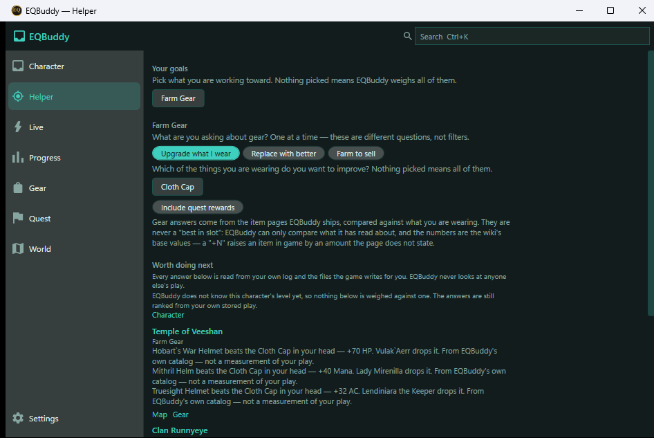
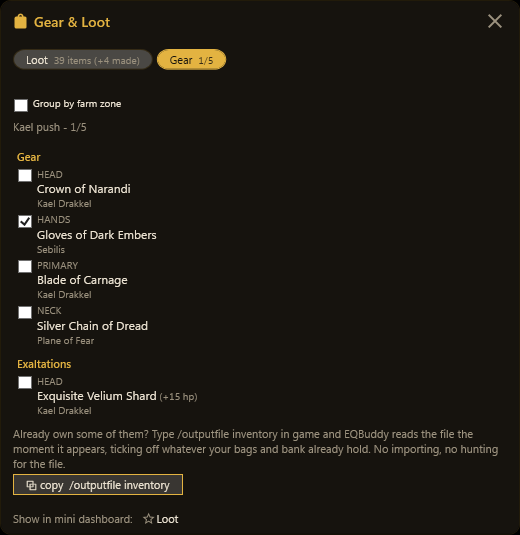
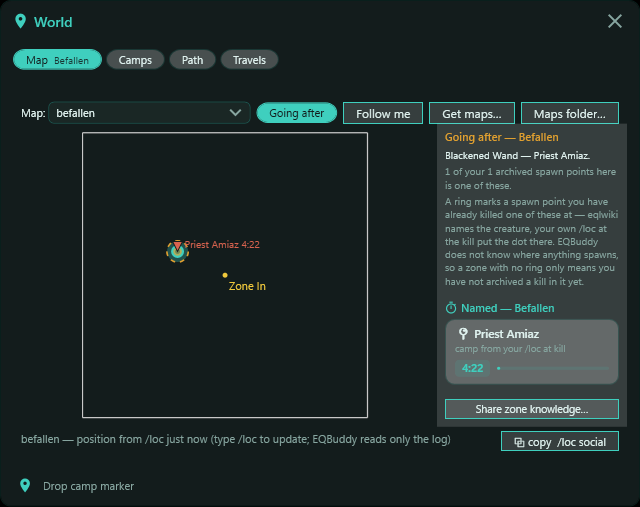
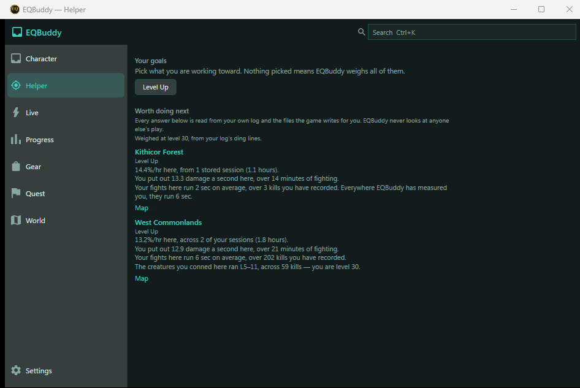
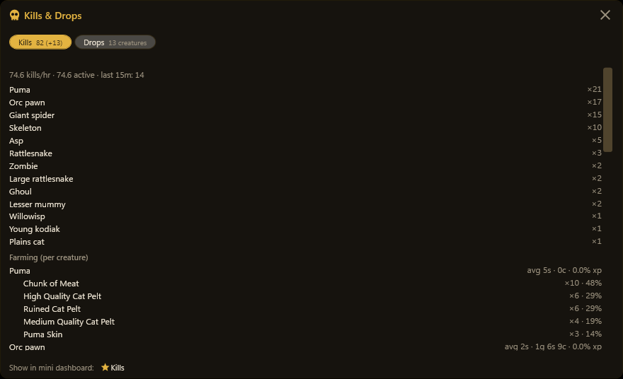

# How EQBuddy works — the deep dive

*This is the long-form home of the landing page's deep dive (DRA-373 D1). Since the
five-section landing (D2), the page carries only a quiet link here, and this file is
the one canonical copy.*

The landing page is the overview. This is the long-form version: two real questions a
player asks, walked through the product step by step, with the screenshots as evidence
and an honest account of where each answer comes from.

- [How to read this](#how-to-read-this)
- ["How do I upgrade my main hand?"](#how-do-i-upgrade-my-main-hand)
- ["Where should I hunt next for EXP?"](#where-should-i-hunt-next-for-exp)
- [Where each answer comes from](#where-each-answer-comes-from)
- [The honest limits](#the-honest-limits)

## How to read this

EQBuddy's own rule is **evidence before confidence**, so this page holds itself to it.

Everything marked **observed** is a number EQBuddy counted in your log — your kills,
your drops, your xp. Everything marked **estimated** is inference and says so. Every
screenshot here is a real capture from the repo's screenshot harness
(`scripts/shoot.ps1`) against a staged test profile — no mockups, no composites.
Character names are test fixtures.

> **The shape of every answer.** Who you are playing → what you own → what you are
> working on → **what to do next**. Both walkthroughs below are that one shape.

## "How do I upgrade my main hand?"

The question every player actually has, and the one a generic "best in slot" list
answers worst — because it doesn't know what you own, what you can reach, or what
you've already half-finished.

**The short answer is now one room.** The Helper (Evolved's "what should I do next?"
room) takes the goal *Farm Gear → Upgrade what I wear*, reads your inventory dump, and
names the catalog items that beat what you are wearing — each with the creature that
drops it and the zone it lives in. The steps below are what that answer is built from.

*Every line is a catalog comparison against a worn item, never a "best in slot" — and
it says so: "From EQBuddy's own catalog — not a measurement of your play."*

### 1. Start from what you own

The Gear Locker reads your inventory dump and compares every wearable you own, slot by
slot, against the wiki's base stats. When something you are carrying is at least as
good on every stat and better on one, the weaker item is marked *outclassed* — "a dump
candidate by arithmetic, not taste." The Helper runs the same arithmetic forward, over
the item pages EQBuddy ships rather than only your bags.

### 2. Name the upgrade and find its source

The Helper names the upgrade and who drops it; the Quest tracker's search takes a
reward, an item, a quest or an NPC. Type the weapon you want and you land on the quest
that provides it — with your own progress against it already counted, because EQBuddy
imported your achievements and scanned your bags. Track an upgrade in the Helper and it
stays your goal across sessions.

*A named gear push, slot by slot, each target with its source — one already ticked, and
the /outputfile command that ticks the rest shipped as a one-click copy.* **observed**

### 3. Let the Guide run the middle

From there it is the Guide: the reward breaks into steps, **NEXT** names the one that
matters now — *kill The Spiroc Lord on Isle 5 and loot the Spiroc Battle Staff* — and
looting the item ticks the box from the log by itself.

### 4. Camp on your own clock

If the source is a named mob, the World map shows the camp with a spawn timer learned
from *your* kills — counting down next to the map, distinct from wiki averages, and
honest about being an estimate until it has seen the cycle. A tracked upgrade's source
creature is ringed on the map where you have seen it spawn (recipe:
`shoot.ps1 -Shot zone-map-target`).

### 5. Get there

The World window's travel view counts the hops from where you stand to the zone, along
the wiki's zone connections. It does not yet know which teleports *your* character has
unlocked — boats and ports count as the single hop the wiki lists them as.

> **Why this beats a spreadsheet.** Each step is fed by the previous surface: the
> Locker knows your slots, the tracker knows your turn-ins, the Guide knows your loot,
> the map knows your kills. You never re-enter a fact EQBuddy already read from the log.

## "Where should I hunt next for EXP?"

EQBuddy won't pretend there is one global best answer. What it has — and a forum thread
doesn't — is what *this character* actually earns, camp by camp.

**The short answer is now one room too.** Pick *Level Up* in the Helper and it ranks the
zones you have actually hunted by the experience rate you earned there, beside your
damage, your fight length and the level band you conned — each figure from your own
stored sessions, with the session count it rests on.

### 1. What is this camp paying right now?

Kills & Drops keeps the running answer during the sitting: kills per hour, and per
creature the average kill time, the coin, and the experience each one is worth to you.

*One session's evidence: 74.6 kills an hour, and what each creature actually pays — orc
pawns die in 2 seconds for coin, pumas take 5 and pay in pelts at this character's own
observed rates. That is a hunting decision, made from your own numbers.* **observed**

### 2. Compare against your own history

Progress keeps every stored sitting — xp/hr, levels, AA — so "was the new zone actually
better than the old camp?" is a chart, not a feeling. The World page's Drops tab
remembers what each creature paid across sessions, not just tonight. That stored history
is what the Helper ranks on: under fifteen minutes of evidence in a zone and it reports no rate at all.

### 3. Cross-check the shared truth

Zone level ranges and spawn mechanics are the community's shared knowledge, and eqlwiki
is its home. EQBuddy links you to the page rather than paraphrasing it — and when your
log shows something the wiki doesn't know, it drafts the page edit for you to paste.

> **This-character, not best-character.** A druid who roots and rots clears a camp at a
> different rate than the wiki's median visitor. Your kills/hr and xp-per-creature are
> the only numbers that were measured on *you* — that is why they are the ones EQBuddy
> shows.

## Where each answer comes from

An honest scorecard. EQBuddy is not a replacement for the wiki — it is the tool that
connects the wiki's shared truth to your private evidence, and sends corrections back.

| The question | A wiki tab alone | EQBuddy over your log | Net |
|---|---|---|---|
| **What does the quest need?** | The source of truth | Mirrors eqlwiki item-for-item, re-harvested weekly; the wiki stays the tie-breaker | ✓ Same truth, in the tool |
| **What have I already done?** | — | Achievements import + bag scan + the log since; turn-ins and half-collected steps counted | ✓ Only your machine knows |
| **What should I upgrade, and who drops it?** | Item pages, one at a time | The Helper compares the catalog against what you wear and names the creature and zone | ✓ Anchored on your own gear |
| **What actually drops here, how often — for me?** | Lists what drops | Observed rates with your kill count as the denominator | ✓ And unknown drops become paste-ready wiki edits |
| **When is my camp due?** | Respawn notes | Timers learned from your own kills, counting down beside the map | ✓ Your clock, not an average |
| **Was tonight better than last week?** | — | Stored session history with level and AA charts; the Helper ranks your zones on it | ✓ Memory a browser doesn't have |
| **Endgame mechanics nobody has confirmed** | Sometimes silent | A stub that says what is missing and asks the player who knows | ~ Honesty, not coverage |
| **How good are the other players?** | — | Never — by principle, not by gap | ✗ Not a feature. Not ever. |

## The honest limits

> **A precise-looking wrong number is worse than none.** Curated game data — spawn
> timers, quest catalogs — is never auto-written from a scrape. The weekly wiki refresh
> *flags* conflicts for a person to resolve, and where quest data conflicts and can't be
> resolved, EQBuddy matches the wiki on purpose: being wrong the same way as the
> community's own reference is recoverable; being uniquely wrong is not.

The same rule shapes the Guide's stubs (a step without a source says so instead of
inventing one), the Locker's "stats not fetched yet" bucket, the Helper's refusal to
quote a rate for a zone it has under fifteen minutes of evidence for, and the observed/estimated labels
above. If EQBuddy tells you something about Norrath, you should be able to ask it how it
knows — and get a real answer.
